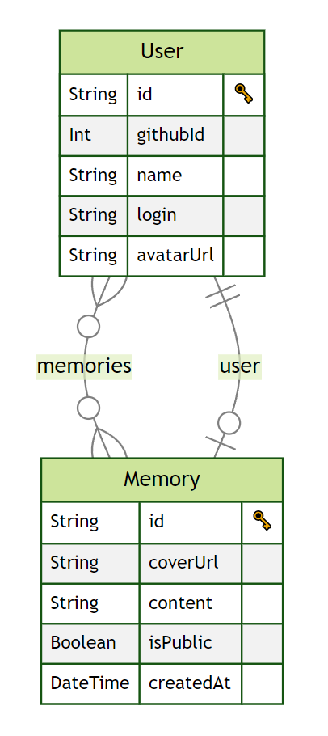
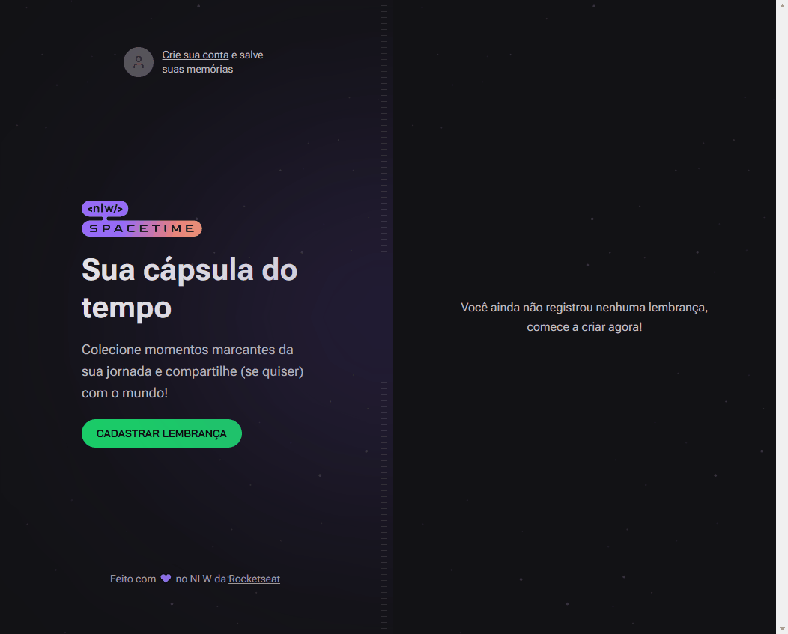

# NLW - Setup
#### _Trilha Ignite_
Aplicação desenvolvida durante o bootcamp NLW, edição 12 - Spacetime, oferecido pela Rocketseat durante os dias 15 a 19 de Maio de 2023, lecionado pelo professor Diego Fernandes.

      
 
 
    

## Descrição
O projeto é uma aplicação para registros de memórias de um usuário autenticado com uma conta do GitHub, permitindo também o cadastro de novas memórias e a visualização de memórias ao longo do tempo. O código foi todo escrito em **TypeScript**, tanto no front-end quanto no back-end em **NodeJS**.

O ambiente do *server* foi feito utilizando o framework [Fastify](https://www.fastify.io/) para fazer o roteamento da aplicação. Para fazer a comunicação com o Banco de Dados (DB), foi utilizado um *Object-Relational Mapping* (ORM) chamado [Prisma](https://www.prisma.io/), que converteu todo o código de TypeScript para SQL, nos padrões de DB do SQLite.


O ambiente de desenvolvimento da versão *web* foi feito utilizando o framework [NextJS](https://nextjs.org/) versão 13.4, para dar o suporte ao TypeScript e à biblioteca ***React***. Os ícones utilizados na interface, foram importados da biblioteca [Lucide](https://lucide.dev/), pois até o momento era a única que fornecia suporte para o NextJs 13.4. A estilização foi feita exclusivamente com as classes do framework ***Tailwind CSS***. O processo de autenticação com a conta do GitHub, foi feito por uma funcionalidade do NextJs, que permite fazer chamadas http quando o usuário é direcionado para uma rota denominada "api", utilizando do "back-end for front-end" integrado do NextJs. O Next previne o envio desnecessário de código JavaScript para o browser, mas em alguns momentos, foi utilizada a diretiva "use client", para que o NextJs permitisse o envio de código JavaScript para o browser. Outra novidade foi o componente *_layout.tsx*, que permite criar uma interface padronizada, que se repete em todas as rotas da aplicação.


O ambiente da versão *mobile* por sua vez foi feito utilizando o framework [Expo](https://docs.expo.dev/), para dar suporte ao **React Native** e garantir acesso aos recursos nativos dos aparelhos dos usuários. A estilização também foi feita com Tailwind, mas na sua versão específica para o React Native, o [Nativewind](https://docs.expo.dev/tutorial/introduction/). Outros pacotes como o [expo-fonts](https://docs.expo.dev/guides/using-custom-fonts/), [react-native-svg](https://docs.expo.dev/versions/latest/sdk/svg/) e [react-native-svg-transformer](https://github.com/kristerkari/react-native-svg-transformer) também foram adicionados ao projeto, para complementar a estilização. O processo de autenticação recebeu o auxílio do pacote [expo-auth-session](https://docs.expo.dev/versions/latest/sdk/auth-session/?utm_source=google&utm_medium=cpc&utm_content=performancemax&gclid=CjwKCAjw36GjBhAkEiwAKwIWyU3fHXuOM4LSG7j3FYX_vqy0oBVRXvClNrokGm0ZSofYT5Rtar40CRoC3WEQAvD_BwE) e [expo-secure-store](https://docs.expo.dev/versions/latest/sdk/securestore/?utm_source=google&utm_medium=cpc&utm_content=performancemax&gclid=CjwKCAjw36GjBhAkEiwAKwIWyU4oksF7e7b1QLQlC3gz-vqEOeVt5qQ448PuBN74JChUccD2u0NwTxoCRUgQAvD_BwE), para armazenar o token no storage do aparelho celular. Também foi utilizado o pacote [expo-router](https://expo.github.io/router/docs/#getting-started), que permite o Expo ter funcionalidades semelhantes ao sitema de roteamento do NextJs.


## Instruções
A aplicação irá verificar nos cookies se há um token armazenado e então fará login automaticamente. A página incial indica se o usuário já está logado e mostra um botão para que seja criada uma memória. Caso não haja um usuário logado, esse botão irá direcionar o usuário para fazer login no GitHub.

Ao clicar no botão de criar memória, surgirá uma seção para que o usuário escolha se essa memória será publica, uma local para visualizar previamente alguma imagem anexada e um espaço para adicionar o texto.

CLicando em "voltar à timeline" é possíver ver a listagem de todas as memórias cadastradas no banco de dados.

É possível verificar o conteúdo de cada aula, selecionando a *branch* específica e o histórico de [commits].

> Caso você seja um desenvolvedor, use as instruções abaixo para instalar as dependências e sugerir alterações para a aplicação.

Após baixar o projeto deste repositório, dentro do diretório de cada parte do projeto (server, web e mobile), você deve usar o comando `npm install` no terminal, para gerar a pasta **node_modules** de cada uma. Ou seja, será necessário abrir três janelas do editor de código, para rodar cada parte individualmente.

```sh
npm install
```
Concluída a instalação das dependências do projeto, use o comando `npm run dev` para visualizar a aplicação na porta definida pelo **NextJS** (basta clicar no link exibido no terminal). Para a pasta do servidor, use o mesmo comando `npm run dev` e projeto irá usar a porta [localhost:3333](http://localhost:3333) para rodar o servidor.
```sh
npm run dev
```
Para visualizar o projeto mobile, é necessário instalar o aplicativo **Expo Go** e estar conectado na mesma rede wi-fi do computador que está rodando o projeto. Em seguida, na pasta do mobile, será necessário usar o comando `npx expo start` para que o Expo gere um QR-code, que será usado para conectar o projeto ao aplicativo instalado no celular.
```sh
npx expo start
```

[//]: # (These are reference links used in the body of this note and get stripped out when the markdown processor does its job. There is no need to format nicely because it shouldn't be seen. Thanks SO - http://stackoverflow.com/questions/4823468/store-comments-in-markdown-syntax)

[commits]: <https://github.com/PedroPaivaDev/nlw-spacetime-ignite/commits/main>